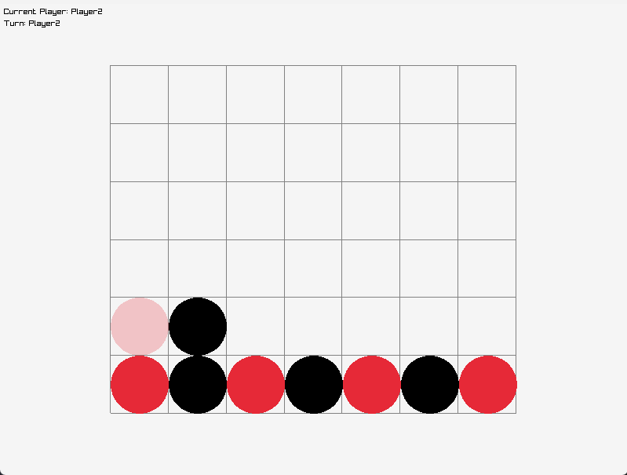

# Omni-Grid

## [Working With Source](Documentation/source.md)

## Hardware Requirements

### Platform

|     Windows     |     UNIX      |     macOS     |
| :-------------: | :-----------: | :-----------: |
|      __X__      | NOT SUPPORTED | NOT SUPPORTED |
| __64-bit only__ |      N/A      |      N/A      |
### Compiler

| MSVC  |      GNU      |     CLANG     |
| :---: | :-----------: | :-----------: |
| __X__ | NOT SUPPORTED | NOT SUPPORTED |

## Documentation

Documentation is hosted using GitHub pages and can be found [here](https://durengo.github.io/Omni-Grid/Documentation/html/index.html).

## Showcase

A small showcase of games that were made with the Omni-Grid framework.

### Tic Tac Toe

Developed by @Durengo

The Grid:

Simple Moves:

Game Over Screen:

Resizable Grid:

### Connect4

Developed by @LastWeekNextDay

The Grid:

Simple Moves:

Note: Pieces which will be pressed by click on the vertical axis of the grid have a fade-in, fade-out animation.

### Checkers

Developed by @LastWeekNextDay

The Grid:

Simple Moves:

Selected Piece Animations:

Attack Moves:

Piece Promotion:

